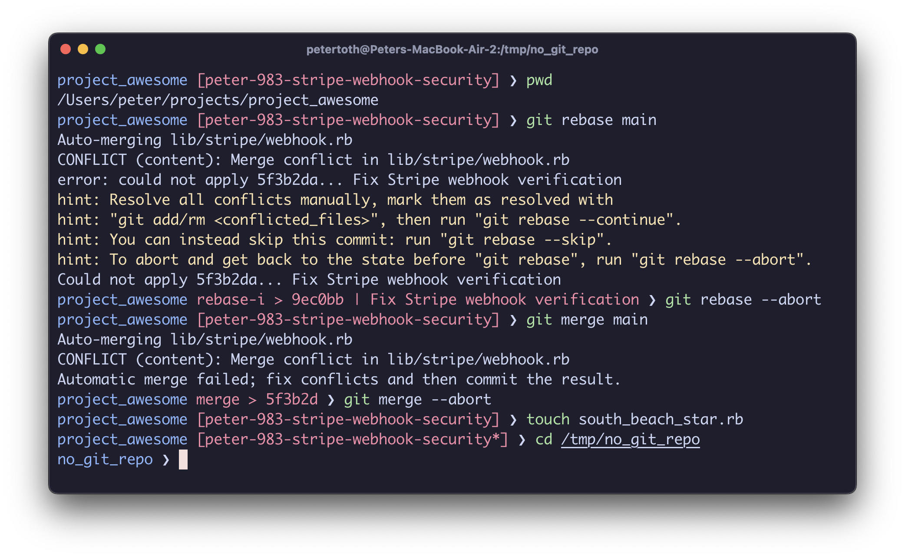

# Peter's Dotfiles

Tools and shortcuts I use to minimize manual work and maximize productivity.

## Terminal prompt (Zsh)



- When in a Git repository:
  - Normal mode: `"{top-level-directory} [{git-branch}] ❯ "`
    - For example: "project_awesome [main] ❯ "
    - It also adds a star after the branch name if there is any change
  - Stopping at a commit: `"{top-level-directory} rebase-i > {target-sha} | {commit-subject} ❯ "`
    - For example: "project_awesome rebase-i > 123456 | Fix Stripe webhook verification ❯ "
    - This lets me know which commit is problematic in case of a rebase conflict or which commit we stopped at during an interactive rebase
- When not in a Git repository:
  - `"{top-level-directory} ❯ "`
    - For example: "project_awesome ❯ "

## Example usage

### Command line tools

```shell
# Git update - for feature branch workflow
# Update the current Git branch with changes from the upstream main branch.
# It's best to work with the most recent version of the app.

# Steps it follows:
# - Pulls the latest changes to the local main branch from its remote counterpart
# - Stashes all the changes if there are any
# - Rebases the current branch to main
# - Pulls the changes back from the stash if we stashed before
# - Prunes the deleted remote branches
$ gupd

# Git: Discard all changes
$ nah

# GitX: Open the current Git repository in SourceTree. (don't ask why I associate GitX with SourceTree)
# It works even if the Git folder is several levels up.
$ gx

# Git amend: Add all changes to the last commit. Very useful for TDD.
$ gam

# Git rebase interactive all: Starts an interactive rebase for all the commits
# on the current branch.
$ grbia

# Git undo: Removes the last commit without losing its changes.
$ gu

# Git rebase fixups: squash all fixup commits into the right commits.
$ grb_fixups
```

### Super secret stuff

Put any \*.sh file into the folder named `local` and they will be loaded recursively.

### Run the active RSpec file or example in the current iTerm2 tab from VS Code by pressing a keystroke

Add the following tasks to your VS Code tasks.json:

The scripts are in this repo, don't forget to copy them and change the path in the command field.

```json
// Run the current line in RSpec (Python)
{
  "label": "run_rspec_line_in_iterm2",
  "type": "shell",
  "command": "~/.asdf/shims/python3", // Python binary
  "args": [
    "~/.dotfiles/iTerm/run_command.py",
    "rspec",
    "${relativeFile}:${lineNumber}"
  ],
  "presentation": {
    "reveal": "never",
    "focus": false
  }
},
// Run the current file in RSpec (AppleScript)
// Applescript in iTerm2 is deprecated
{
  "label": "run_rspec_file_in_iterm2",
  "type": "shell",
  "command": "osascript",
  "args": [
    "~/.dotfiles/iTerm/run_command.scpt",
    "rspec",
    "${relativeFile}"
  ],
  "presentation": {
    "reveal": "never",
    "focus": false
  }
}
```

Add the following to your VS Code keybindings.json:

```json
{
  "key": "cmd+r cmd+t",
  "command": "workbench.action.tasks.runTask",
  "args": "run_rspec_line_in_iterm2",
  "when": "editorTextFocus && resourceLangId == ruby"
},
{
  "key": "cmd+r t",
  "command": "workbench.action.tasks.runTask",
  "args": "run_rspec_file_in_iterm2",
  "when": "editorTextFocus && resourceLangId == ruby"
},
```

Open a spec file and press cmd+r cmd+t to run the current line the current iTerm2 tab.

#### Add buttons to the statusbar to run RSpec for the current file or line

Install the [Commands VS Code extension](https://marketplace.visualstudio.com/items?itemName=fabiospampinato.vscode-commands)

Add the following to your VS Code settings.json:

```json
{
  "command": "workbench.action.tasks.runTask",
  "arguments": ["run_rspec"],
  "text": "$(play)$(beaker) File",
  "tooltip": "File",
  "alignment": "left",
  "color": "#fff",
  "filterLanguageRegex": "ruby"
},
{
  "command": "workbench.action.tasks.runTask",
  "arguments": ["run_rspec_for_current_line"],
  "text": "$(play)$(beaker) Line",
  "tooltip": "Line",
  "alignment": "left",
  "color": "#fff",
  "filterLanguageRegex": "ruby"
}
```

### SourceTree custom actions

#### Fixup commit for the selected commit

In SourceTree: Right click on a commit > Custom Actions > Fixup. It will create a fixup commit
for the selected commit using the files added to staging.

Create a new SourceTree custom action

- Menu caption: Fixup
- Script to run: ~/.dotfiles/git/sourcetree_custom_actions/create_fixup_commit.sh
- Parameters: $SHA

#### Amend all changes to the selected commit

In SourceTree: Right click on a commit > Custom Actions > Amend all. It will amend
all the changes to the selected commit.

SourceTree custom action settings:

- Menu caption: Amend all
- Script to run: ~/.dotfiles/git/sourcetree_custom_actions/amend_all.sh
- Parameters: $SHA

## Install

```shell
git clone git@github.com:tothpeter/dotfiles.git
mv ~/dotfiles ~/.dotfiles
# Homebrew https://brew.sh
/bin/bash -c "$(curl -fsSL https://raw.githubusercontent.com/Homebrew/install/HEAD/install.sh)"
```

## VS Code

### Sync config

```shell
ln -s ~/.dotfiles/vs_code/settings.json ~/Library/Application\ Support/Code/User/settings.json
ln -s ~/.dotfiles/vs_code/keybindings.json ~/Library/Application\ Support/Code/User/keybindings.json
ln -s ~/.dotfiles/vs_code/tasks.json ~/Library/Application\ Support/Code/User/tasks.json
ln -s ~/.dotfiles/vs_code/snippets/ ~/Library/Application\ Support/Code/User/snippets
```

### Make `code` command available in the terminal

Command Palette > shell command

## iTerm2

### Sync config

```shell
# Specify the preferences directory
defaults write com.googlecode.iterm2 PrefsCustomFolder -string "~/.dotfiles/iTerm/settings"

# Tell iTerm2 to use the custom preferences in the directory
defaults write com.googlecode.iterm2 LoadPrefsFromCustomFolder -bool true
```

### Turn off the login banner ("Last login ...")

```shell
touch ~/.hushlogin
```

## Oh My ZSH

### Install

https://ohmyz.sh/#install

### Sync config

```shell
mv ~/.zshrc ~/.zshrc.old
ln -s ~/.dotfiles/zsh/zshrc.symlink ~/.zshrc
```

### zsh-syntax-highlighting plugin

It has to be listed LAST in the plugins list in `~/.zshrc` for it to be enabled.

```shell
git clone https://github.com/zsh-users/zsh-syntax-highlighting.git ${ZSH_CUSTOM:-~/.oh-my-zsh/custom}/plugins/zsh-syntax-highlighting
```

### Setup local secrets

```shell
touch $DOTFILES_PATH/local/localrc.sh
```

## Git

### Sync config

```shell
ln -s ~/.dotfiles/git/.gitconfig.global ~/.gitconfig
```

### Signing commits with GPG

```shell
brew install gpg
ln -s /Volumes/DriveD/Dropbox/work/system/.gnupg ~/.gnupg
```

#### Sourcetree

```shell
ln `brew --prefix gpg`/bin/gpg `brew --prefix gpg`/bin/gpg2
```

Sourcetree > Preferences > Advanced > set custom path for GPG Program to `brew --prefix gpg`/bin/gpg

Sourcetree > Repo settings > Security > Enable GPG signing

Sourcetree > commit > Commit options > Sign commit

## asdf

### Install

```shell
brew install asdf
```

### Update

```shell
asdf plugin-update ruby
```

## Ruby

### Install

```shell
asdf plugin add ruby
asdf install ruby latest
asdf global ruby latest # set global ruby version
```

### Initial Set-up

```shell
ln -s ~/.dotfiles/ruby/irbrc.symlink ~/.irbrc
ln -s ~/.dotfiles/ruby/gemrc.symlink ~/.gemrc
```

### Install Rails and Bundler

```shell
gem install rails
gem install bundler
```

## Other tools

```shell
brew install fzf
$(brew --prefix)/opt/fzf/install # To install key bindings to iTerm and fuzzy completion

brew install thefuck

# Local Sherpa
git clone git@github.com:tothpeter/local_sherpa.git ~/.dotfiles/lib/local_sherpa
```

### VLC

```shell
mv -v ~/Library/Preferences/org.videolan.vlc/vlcrc ~/.dotfiles/others/vlc/vlcrc
ln -s ~/.dotfiles/others/vlc/vlcrc ~/Library/Preferences/org.videolan.vlc/vlcrc
```

## OSX Shortcuts

To check what we have:

```shell
defaults read -g NSUserKeyEquivalents
```

### Merge All Windows shortcut for all apps (cmd+shift+m)

```shell
defaults write -g NSUserKeyEquivalents -dict-add "Merge All Windows" -string '@$m'
```
